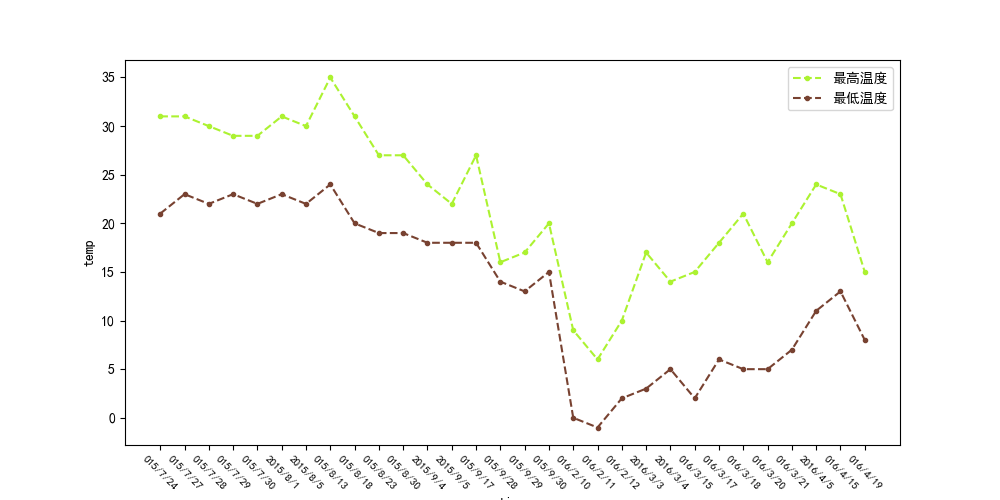

# 数据挖掘课设

## 小组分工

|刘佳璇|徐硕|许城伟|冯江涛|韩腾杰|
|----|----|----|----|----|
|构建模型|数据收集|数据标注|课程设计报告|ppt|
|20%|20%|20%|20%|20%|

## 引言

### 选题背景与意义

预测是否出行的意义

### 课程设计目标、思路与方法

#### 课题目标

通过天气的各种特征比如气温，风力预测是否适合出行

#### 设计思路

研究的问题：通过天气特征预测是否适合出行
数据来源：通过python爬虫爬取北京市十年的天气情况
数据处理：清楚数据中的噪声和无法使用的特征
构建模型：使用python构建模型并且训练模型
结果分析：对于模型预测的结果进行分析，分析每个模型的优缺点

#### 研究方法

比较法：通过不同模型结果之间的对比得出每个模型的特点

## 数据准备

使用python爬虫爬取北京市十年的天气数据。并且人工标注是否适合出行。总数据量为3000条数据

数据网址：<http://lishi.tianqi.com/beijing/202211.html>

标注完成的数据概览


### 数据清理

**温度特征具有单位需要转化为整数类型**

```python
def tran_temp(read_csv):
    max_ = read_csv['最高温度'].values
    min_ = read_csv['最低温度'].values
    max_temp = re_draw(r'\d+|-\d+', max_)
    min_temp = re_draw(r'\d+|-\d+', min_)
    max_temp = [int(i) for i in max_temp]
    min_temp = [int(i) for i in min_temp]
    return max_temp, min_temp
```

**风力风向特征的风向无法使用需要去除**

```python
def tran_wind(df):
    """
    :param df:
    :return: 风力列表
    """
    wind_power = []
    wind_ = df['风向'].values
    for i in wind_:
        result = re.search(r'\d', i)
        if result:
            wind_power.append(result.group())
        else:
            wind_power.append(random.randint(0, 2))
    return wind_power
```

**天气的特征是文字需要转换成数值**

```python
def tran_weather_num(df):
    """
    :param df: 读取的数据
    :return: feature_n转换完成的列表，feature存储天气种类的列表
    """
    feature_l = df['天气'].values
    feature = []
    feature_n = []
    for i in feature_l:
        if i not in feature:
            feature.append(i)
    for i in feature_l:
        for j in feature:
            if i == j:
                feature_n.append(feature.index(j))
    # print(feature)
    return feature_n, feature
```

### 数据可视化

**绘制气温折线图以便观察K-means算法的效果**

```python
# 气温折线图
def plot_line(read_csv, start, stop):
    x_data = []
    for i in read_csv['日期'].values[start:stop]:
        x_data.append(i[-8:])
    y_data_max, y_data_min = tran_temp(read_csv)
    plt.figure(figsize=(10, 5))
    plt.rcParams['font.sans-serif'] = ['SimHei']  # 使用黑体字体
    plt.rcParams['axes.unicode_minus'] = False  # 设置负号显示 True 或 False，根据需要设置
    plt.plot(x_data, y_data_max[start:stop], c='#acf231', label='最高温度', linestyle='--', marker='.')
    plt.plot(x_data, y_data_min[start:stop], c='#784231', label='最低温度', linestyle='--', marker='.')
    plt.legend()
    plt.xticks(fontsize=8, rotation=-45)
    plt.xlabel('time')
    plt.ylabel('temp')
    plt.show()
```

**绘制天气柱状图以便观察K-means算法的效果**

```python
def weather_bar(d):
    """
    :param d:字典类型的参数记录了每种天气出现的数量
    :return:
    """
    # 抛弃出现次数太少的天气
    n_d = {key: value for key, value in d.items() if value >= 13}
    categories = n_d.keys()
    values = n_d.values()
    print(len(n_d))
    plt.bar(categories, values)
    # 在每个柱子上显示数值
    for i, value in enumerate(values):
        plt.text(i, value + 0.5, str(value), ha='center', va='bottom')
    # 添加标题和标签
    plt.rcParams['font.sans-serif'] = ['SimHei']  # 使用黑体字体
    plt.title('天气柱状图')
    plt.xticks(fontsize=8, rotation=-45)
    plt.xlabel('Categories')
    plt.ylabel('Values')
    plt.show()
```

**返回最终处理完毕的数据并封装成模块供其他文件使用**

```python
def final_():
    # 对数据转换
    # 保留索引，日期，最高气温，最低气温，天气，风速，是否出行
    # 合并数据
    con = merge_data()
    con_n = con.drop(columns='星期')
    # 转换温度
    max_temp, min_temp = tran_temp(con_n)
    con_n.iloc[:, 1] = max_temp
    con_n.iloc[:, 2] = min_temp
    # 统计天气
    werther_n, werther_t = tran_weather_num(con_n)
    con_n.iloc[:, 3] = werther_n
    # 处理风力数据
    wind_power = tran_wind(con_n)
    con_n.iloc[:, 4] = wind_power
    return con_n


if __name__ == "__main__":
    con = final_()
```

## 模型构建与模型评估

环境搭建
python版本3.10
使用sk-learn库构建机器学习模型
使用tensorflow库完成神经网络的构建

### K-means算法

#### 加载数据

调用之间封装好的模块加载数据
通过dataframe的切片方式去除掉无法使用的时间数据

```python
from data_man import data_m

data_o = data_m.merge_data()
data = data_m.final_()
data_t = data.iloc[:, 1:]
```

#### 模型构建

```python
from sklearn.cluster import KMeans

# 因为有四个季节所以k选择4
k = 4

# 创建KMeans模型
kmeans = KMeans(n_clusters=k)

# 训练模型并进行聚类
kmeans.fit(data_t)

# 获取簇标签
labels = kmeans.labels_
# print(labels)

# 获取质心
centroids = kmeans.cluster_centers_
```

#### 分类结果

将分类完的标签添加到原始数据中打印气温折线图和天气柱状图

```python
# 将标签添加到原始数据中
data_o['cluster_label'] = labels

# 绘制聚类结果
for i in range(k):
    data_m.plot_line(data_o[data_o['cluster_label'] == i], 0, 30)
    data_m.final_bar(data_o[data_o['cluster_label'] == i])
```





#### 完整代码

```python
from sklearn.cluster import KMeans
from data_man import data_m

data_o = data_m.merge_data()
data = data_m.final_()
data_t = data.iloc[:, 1:]

# 因为有四个季节所以k选择4
k = 4

# 创建KMeans模型
kmeans = KMeans(n_clusters=k)

# 训练模型并进行聚类
kmeans.fit(data_t)

# 获取簇标签
labels = kmeans.labels_
# print(labels)

# 获取质心
centroids = kmeans.cluster_centers_
# print(centroids)

# 将标签添加到原始数据中
data_o['cluster_label'] = labels


# 绘制聚类结果
for i in range(k):
    data_m.plot_line(data_o[data_o['cluster_label'] == i], 0, 30)
    data_m.final_bar(data_o[data_o['cluster_label'] == i])
```

### 逻辑回归模型

#### 加载数据

调用之间封装好的模块加载数据
通过dataframe的切片方式将数据划分为标签和特征
使用sklearn中的train_test_split函数划分训练集和测试集


```python
from data_man import data_m
from sklearn.model_selection import train_test_split

data = data_m.final_()
features = data.iloc[:, 1:-1]
targets = data.iloc[:, -1]
X_train, X_test, y_train, y_test = train_test_split(features, targets, test_size=0.2, random_state=42)
```

#### 模型构建

```python
from sklearn.linear_model import LogisticRegression

# 创建线性回归模型
reg = LogisticRegression()

# 训练模型
reg.fit(X_train, y_train)

# 进行预测
predictions = reg.predict(X_test)
```

#### 评估模型

```python
from sklearn.metrics import accuracy_score, precision_score, recall_score

# 评估模型
# 计算准确率
accuracy = accuracy_score(y_test, predictions)

# 计算召回率
recall = recall_score(y_test, predictions)

# 计算精确率
precision = precision_score(y_test, predictions)

print("逻辑回归accuracy:", accuracy)
print("逻辑回归recall:", recall)
print("逻辑回归precision:", precision)
```

**评估结果**

accuracy: 0.8019323671497585
recall: 0.9587628865979382
precision: 0.7766179540709812

### 决策树算法

#### 加载数据

调用之间封装好的模块加载数据
通过dataframe的切片方式将数据划分为标签和特征
使用sklearn中的train_test_split函数划分训练集和测试集


```python
from data_man import data_m
from sklearn.model_selection import train_test_split

data = data_m.final_()
features = data.iloc[:, 1:-1]
targets = data.iloc[:, -1]
X_train, X_test, y_train, y_test = train_test_split(features, targets, test_size=0.2, random_state=42)
```

#### 模型构建

```python
from sklearn.tree import DecisionTreeClassifier

# 创建决策树模型
reg = DecisionTreeClassifier()

# 训练模型
reg.fit(X_train, y_train)

# 进行预测
predictions = reg.predict(X_test)
```

#### 评估模型

```python
from sklearn.metrics import accuracy_score, precision_score, recall_score

# 评估模型
# 计算准确率
accuracy = accuracy_score(y_test, predictions)

# 计算召回率
recall = recall_score(y_test, predictions)

# 计算精确率
precision = precision_score(y_test, predictions)

print("决策树accuracy:", accuracy)
print("决策树recall:", recall)
print("决策树precision:", precision)
```

**预测结果**

决策树accuracy: 0.856682769726248
决策树recall: 0.8737113402061856
决策树precision: 0.8944591029023746

### 随机森林

#### 加载数据

调用之间封装好的模块加载数据
通过dataframe的切片方式将数据划分为标签和特征
使用sklearn中的train_test_split函数划分训练集和测试集


```python
from data_man import data_m
from sklearn.model_selection import train_test_split

data = data_m.final_()
features = data.iloc[:, 1:-1]
targets = data.iloc[:, -1]
X_train, X_test, y_train, y_test = train_test_split(features, targets, test_size=0.2, random_state=42)
```

#### 模型构建

```python
from sklearn.ensemble import RandomForestClassifier

random_forest = RandomForestClassifier(n_estimators=100, random_state=42)

# 训练模型
random_forest.fit(X_train, y_train)

# 进行预测
predictions = random_forest.predict(X_test)
```

#### 评估模型

```python
from sklearn.metrics import accuracy_score, precision_score, recall_score

# 评估模型
# 计算准确率
accuracy = accuracy_score(y_test, predictions)

# 计算召回率
recall = recall_score(y_test, predictions)

# 计算精确率
precision = precision_score(y_test, predictions)

print("随机森林accuracy:", accuracy)
print("随机森林recall:", recall)
print("随机森林precision:", precision)
```

**预测结果**

随机森林accuracy: 0.8840579710144928
随机森林recall: 0.9072164948453608
随机森林precision: 0.9072164948453608

### 神经网络

#### 加载数据

调用之间封装好的模块加载数据
通过dataframe的切片方式将数据划分为标签和特征
随机分配数据集并转换成张量


```python
from data_man import data_m
import numpy as np
import tensorflow as tf

data = data_m.final_()
features = data.iloc[:, 1:-1]
X = features.to_numpy()
targets = data.iloc[:, -1]
y = targets.to_numpy()

# 随机打乱数据（因为原始数据是顺序的，顺序不打乱会影响准确率）
np.random.seed(1)
np.random.shuffle(X)
np.random.seed(1)
np.random.shuffle(y)

train_index = 2700

# 需要指定转换完的数据类型

X_train = tf.convert_to_tensor(X[:train_index, :], dtype=tf.float32)
y_train = tf.convert_to_tensor(y[:train_index], dtype=tf.float32)
X_test = tf.convert_to_tensor(X[train_index:, :], dtype=tf.float32)
y_test = tf.convert_to_tensor(y[train_index:], dtype=tf.float32)
```

#### 模型构建

设置三个隐藏层激活函数为relu
因为是二元分类问题所以输出层的激活函数为sigmoid
损失函数是BinaryCrossentropy
优化器为adam优化器,adam优化器可以动态调整学习率更快地训练模型

```python
from keras import Sequential
from keras.src.layers import Dense
import keras
import tensorflow as tf

# 初始化Sequential模型
model = Sequential()

# 添加神经网络层
model.add(Dense(units=64, activation='relu', input_shape=(4,)))  # input_shape是输入特征的形状
model.add(keras.layers.Dropout(0.2))  # Dropout 层用于防止过拟合
model.add(Dense(units=64, activation='relu'))
model.add(keras.layers.Dropout(0.2))  # Dropout 层用于防止过拟合
model.add(Dense(units=64, activation='relu'))
model.add(keras.layers.Dropout(0.2))  # Dropout 层用于防止过拟合
model.add(Dense(units=1, activation='sigmoid'))  # 输出层，units取决于你要预测的标签数量

# 编译模型
model.compile(optimizer='adam', loss=keras.losses.BinaryCrossentropy())  # 根据你的问题选择适当的损失函数和优化器

# 使用 fit() 方法拟合模型
model.fit(X_train, y_train, epochs=200, batch_size=32, validation_split=0.2)

model.save('./model/test')

predictions = model.predict(X_test)
```

#### 模型评估

遍历预测结果把大于0.5的值记为1
遍历预测结果把小于等于0.5的值记为0

```python
new_predictions = []
for i in predictions:
    if i[0] > 0.5:
        i[0] = 1
    else:
        i[0] = 0
    # print(i)
    new_predictions.append(i[0])

# 评估模型
# 计算准确率
accuracy = accuracy_score(y_test, new_predictions)

# 计算召回率
recall = recall_score(y_test, new_predictions)

# 计算精确率
precision = precision_score(y_test, new_predictions)
```

**预测结果**

神经网络accuracy: 0.8606965174129353
神经网络recall: 0.9098360655737705
神经网络precision: 0.8671875

## 结果分析

对于决策树和随机森林算法来说，随机森林算法的准确率、精确率、召回率都要高于决策树算法。因为随机森林算法是集成学习算法由多个决策树算法构成，采用多个决策树投票的方式来决定最总的结果，这样的集成方法通常会降低模型的偏差，提高模型的泛化能力，减少噪声对模型的影响。

对于神经网络来说训练的次数不宜过高在我们的模型中选择的训练此时是200次，我们还测试了训练更高的次数，随着训练次数的增加模型在测试集上的的性能并没有提升，反而因为发生了过拟合而下降，我们需要选择适当的训练次数，使模型在测试集上具有更好的结果。

