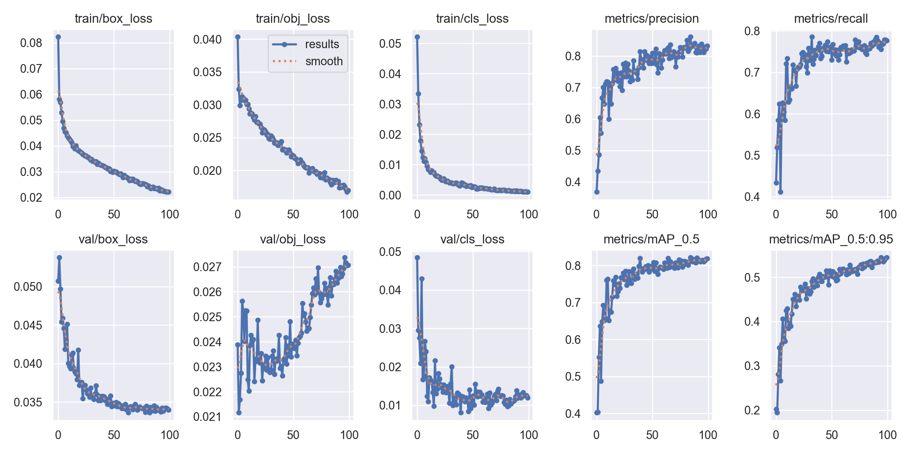
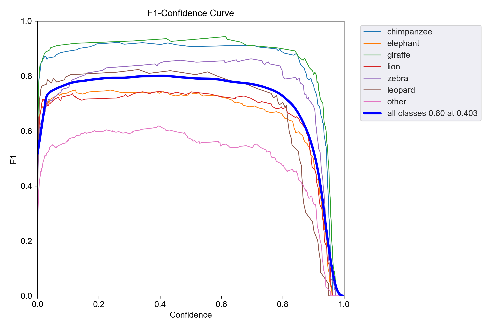
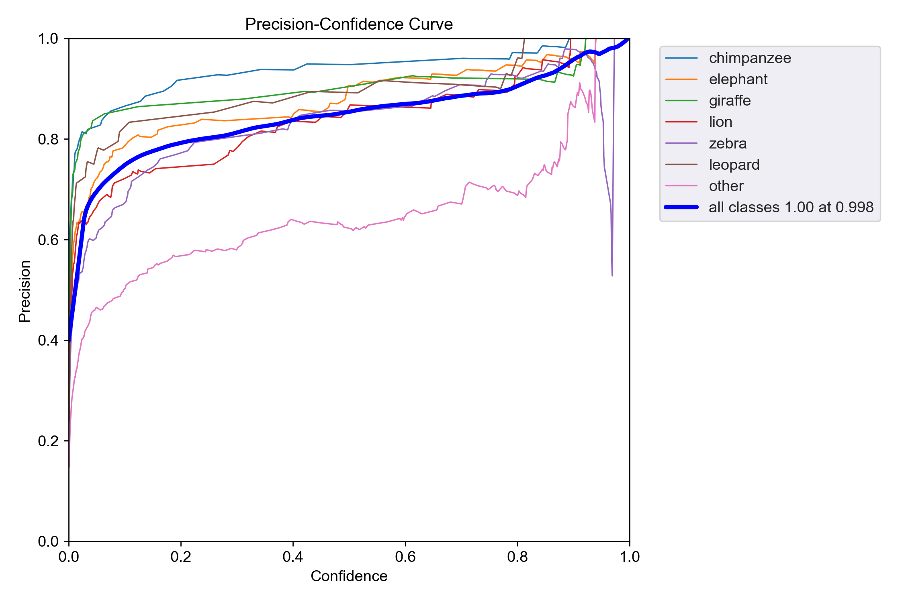
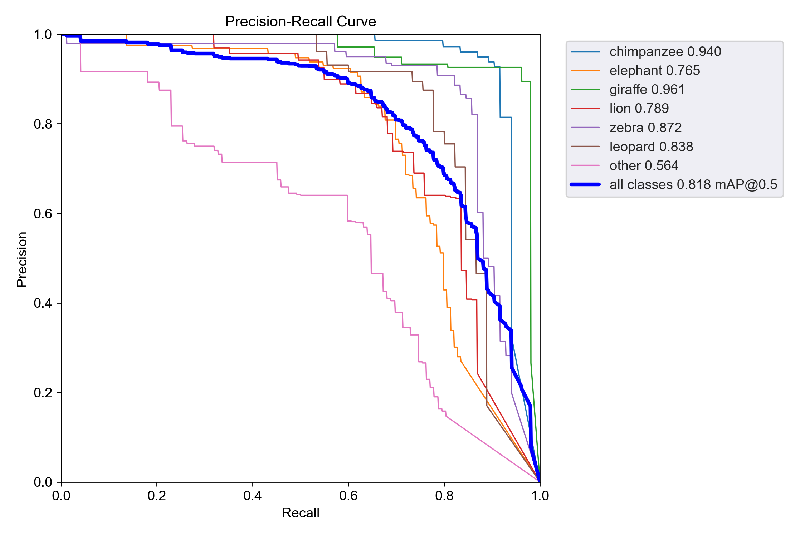
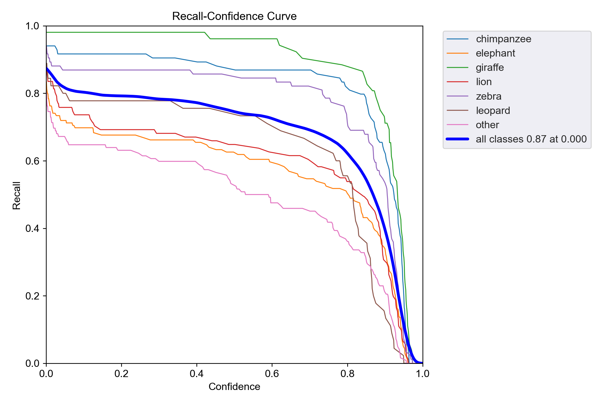

# 深度学习

[toc]

## 项目概述

**野生动物识别**

### 选题背景

野生动物识别可以记录野生动物的生活规律，包括迁徙，觅食，求偶等,可以为科学研究提供宝贵的数据，帮助我们更深入地了解动物的行为、习性和进化等方面。

了解野生动物的活动规律可以帮助我们更合理地利用自然资源，避免过度开发和浪费，可以通过记录野生动物的活动范围开发为旅游景点，为生态旅游提供指导，使游客能够在不干扰动物生活的情况下观赏和了解它们，带动当地的经济发展。

了解野生动物的活动规律，可以帮助我们制定更好的保护措施，用于野生动物的保护。可以为野生动物保护和管理提供科学依据，制定更有效的管理策略，保护野生动物也是保护自然环境对人类的发展也有好处。


## 数据收集以及预处理

### 引用数据集

数据集引用的kaggle网站的开源数据集如下

引用数据集1:

- 地址链接:<https://www.kaggle.com/datasets/jirkadaberger/zoo-animals>
- 描述:动物园中的常见动物
- 格式:VOC模式

引用数据集2:

- 地址链接:<https://www.kaggle.com/datasets/biancaferreira/african-wildlife>
- 描述:非洲常见的野生动物
- 格式:yolo格式

### 数据收集

用于标注的数据集是从纪录片中提取出的图片

纪录片地址:

- <https://www.youtube.com/watch?v=xV_O_d6wN_8>
- <https://www.youtube.com/watch?v=KNmdrOf7MwU>
- <https://www.youtube.com/watch?v=pL3RakTl_hc>
- <https://www.youtube.com/watch?v=kzpJYc6MUzk>
- <https://www.youtube.com/watch?v=O4NJvWpmNJU>
- <https://www.youtube.com/watch?v=uFIEIFLJtSQ&t=39s>

### 数据处理

**定义抽取视屏中的帧为图片的函数ExtractVideoFrame**

**函数参数说明**
- video_input:输入视屏地址
- output_path:图片输出地址
- frame_frequency:每隔多少帧提取一张图片

**函数实现说明**

判断输出路径是否为空,为空则创建文件夹

利用opencv库读取输入视屏

循环遍历视屏所有帧,利用times记录是第几帧

当times是frame_frequency的整数倍时输出一张图片完成抽帧

```python
import os
import cv2

def ExtractVideoFrame(video_input, output_path, frame_frequency):

    if not os.path.exists(output_path):
        os.mkdir(output_path)

    times = 0 
    count = 0 
    cap = cv2.VideoCapture(video_input)  

    print('开始提取', video_input, '视频的图片')
    while True:
        times += 1
        res, image = cap.read()  
        if not res:
            print('图片提取结束')
            break
        if times % frame_frequency == 0:
            img_name = str(count).zfill(8) + '.jpg'
            cv2.imwrite(output_path + os.sep + img_name, image)
            count += 1

            print(output_path + os.sep + img_name)  # 
    cap.release()


if __name__ == "__main__":
    video_inputs = [r"D:\Picture\zebra\zebra.mp4"]
    output_paths = [r"D:\Picture\zebra"]
    d = dict(zip(video_inputs, output_paths))
    for k, v in d.items():
        ExtractVideoFrame(k, v)
```

### 数据标注

使用labelimg图片标注工具进行标注

标注类型为yolo格式

预定义类型文件

```txt
chimpanzee
elephant
giraffe
lion
zebra
leopard
other
```

标注完成的图片


### 数据标注中出现的问题以及解决方案

在数据标注中有时会漏掉图片或者失误删除图片导致图片数和标签数不匹配

**对比名称脚本**

**脚本实现说明**

读取图片和标签文件夹下的所有文件储存在两个列表中

因为图片和标签只有后缀名不同

将两个列表中的每一个元素通过列表生成式去掉后缀转换成集合

利用集合的difference方法获取两个集合的差集找到不同的文件

```python
import os

labelPath = r'D:\DeskTop\data\eleimages'
imagesPath = r'D:\DeskTop\data\elelabel'

labelList = os.listdir(labelPath)
imagesList = os.listdir(imagesPath)

setLabelList = set(i[:-3] for i in labelList)
setImagesList = set(i[:-3] for i in imagesList)

print(setLabelList.difference(setImagesList))
print(setImagesList.difference(setLabelList))
```

****

因为前期工作没有做好导致部分组员的预定义类型文件出现不同

**转换类型脚本**

**脚本实现说明**

yolo的标注格式的txt文本中的每行的第一个数字为类型

脚本实现思路

只需要更改每个txt文本每行的第一个数字即可

读取所有标签文件

再读取标签文件的每一行

找到错误的类型并修改为正确的写入到新的文件中完成对类型的转换

```python
import os

txtfilepath = r"D:\DeskTop\casrs\elelabel"  # 原始txt文件所存文件夹，文件夹可以有一个或多个txt文件
savefilepath = r"D:\DeskTop\casrs\bak"  # 更改后txt文件存放的文件夹
total_txt = os.listdir(txtfilepath)  # 返回指定的文件夹包含的文件或文件夹的名字的列表
list = range(len(total_txt))  # 创建从0到num的整数列表

for i in list:  # 遍历每一个文件
    name = total_txt[i]
    readfile = open(txtfilepath + "/" + name, 'r')  # 读取文件
    savetxt = open(savefilepath + "/" + name, 'w')
    fline = readfile.readlines()  # 读取txt文件中每一行
    for j in fline:
        if j[0] == '0':
            b = '1' + j[1:]
            print(b)
        if j[0] == '1':
            b = '0' + j[1:]
        if j[0] == '2':
            b = '3' + j[1:]
        if j[0] == '3':
            b = '2' + j[1:]
        if j[0] == '4':
            b = '3' + j[1:]
        if j[0] == '5':
            b = '4' + j[1:]
        if j[0] == '6':
            b = j[:]
        savetxt.write(b)  # 写入新的文件中
```

### 数据预处理

**定义划分数据集脚本**

**copy_data函数参数说明**
- start:从第几个文件开始
- stop:到第几个文件结束
- root_dir:需要划分的根目录
- list_:根目录中所有文件名的列表
- name:划分到当前目录下的文件夹名

**copy_data函数实现说明**

遍历根目录中所有文件名的列表

创建划分当前目录下的文件夹

复制拼接要复制的文件路径和复制到的文件路劲

调用shutil.copy()方法复制文件

**split_data函数参数说明**
- train_s:训练集大小
- test_s:验证集大小
- root_dir:需要划分的根目录

**split_data函数实现说明**

调用三次copy_data函数并给出需要划分的文件数量以及储存地址
将数据集分为训练集、验证集和测试集

```python
import os
import shutil


def copy_data(start, stop, root_dir, list_, name):
    for i in range(start, stop):  # 遍历目录下的所有文件夹
        path = os.path.join(root_dir, list_[i])
        full_path = path
        des_path = os.path.join(root_dir, name)
        folder = os.path.exists(des_path)
        if not folder:  # 判断
            os.makedirs(des_path)  # 创建文件夹
        shutil.copy(full_path, des_path)  # 移动文件到目标路径


def split_data(train_s, val_s, root_dir):
    list_ = os.listdir(root_dir)
    num = len(list_)
    copy_data(0, train_s, root_dir, list_, "train")
    copy_data(train_s, train_s + val_s, root_dir, list_, "val")
    copy_data(train_s + val_s, num, root_dir, list_, "test")


if __name__ == "__main__":
    root = r"D:\DeskTop\data\bak"

    train = 400
    val = 50
    split_data(train, val, root)
```

## 训练过程

### 本地环境配置

本地环境文件

```yaml
name: python3.8
channels:
  - pytorch
  - defaults
dependencies:
  - blas=1.0=mkl
  - ca-certificates=2023.08.22=haa95532_0
  - cudatoolkit=10.2.89=h74a9793_1
  - freetype=2.12.1=ha860e81_0
  - intel-openmp=2023.1.0=h59b6b97_46320
  - jpeg=9b=hb83a4c4_2
  - lerc=3.0=hd77b12b_0
  - libdeflate=1.17=h2bbff1b_1
  - libffi=3.4.4=hd77b12b_0
  - libpng=1.6.39=h8cc25b3_0
  - libtiff=4.5.0=h8a3f274_0
  - libuv=1.44.2=h2bbff1b_0
  - libwebp=1.2.4=h2bbff1b_0
  - libwebp-base=1.2.4=h2bbff1b_1
  - lz4-c=1.9.4=h2bbff1b_0
  - mkl=2023.1.0=h6b88ed4_46358
  - mkl-service=2.4.0=py38h2bbff1b_1
  - mkl_fft=1.3.8=py38h2bbff1b_0
  - mkl_random=1.2.4=py38h59b6b97_0
  - ninja=1.10.2=haa95532_5
  - ninja-base=1.10.2=h6d14046_5
  - numpy=1.24.3=py38h79a8e48_1
  - numpy-base=1.24.3=py38h8a87ada_1
  - openssl=3.0.12=h2bbff1b_0
  - pip=23.3.1=py38haa95532_0
  - python=3.8.18=h1aa4202_0
  - pytorch=1.8.1=py3.8_cuda10.2_cudnn7_0
  - setuptools=68.0.0=py38haa95532_0
  - sqlite=3.41.2=h2bbff1b_0
  - tbb=2021.8.0=h59b6b97_0
  - tk=8.6.12=h2bbff1b_0
  - torchaudio=0.8.1=py38
  - torchvision=0.9.1=py38_cu102
  - typing_extensions=4.7.1=py38haa95532_0
  - vc=14.2=h21ff451_1
  - vs2015_runtime=14.27.29016=h5e58377_2
  - wheel=0.41.2=py38haa95532_0
  - xz=5.4.2=h8cc25b3_0
  - zlib=1.2.13=h8cc25b3_0
  - zstd=1.5.5=hd43e919_0
  - pip:
      - certifi==2023.11.17
      - charset-normalizer==3.3.2
      - colorama==0.4.6
      - contourpy==1.1.1
      - cycler==0.12.1
      - fonttools==4.46.0
      - gitdb==4.0.11
      - gitpython==3.1.40
      - idna==3.6
      - importlib-resources==6.1.1
      - kiwisolver==1.4.5
      - matplotlib==3.7.4
      - opencv-python==4.8.1.78
      - packaging==23.2
      - pandas==2.0.3
      - pillow==10.1.0
      - psutil==5.9.6
      - py-cpuinfo==9.0.0
      - pyparsing==3.1.1
      - python-dateutil==2.8.2
      - pytz==2023.3.post1
      - pyyaml==6.0.1
      - requests==2.31.0
      - scipy==1.10.1
      - seaborn==0.13.0
      - six==1.16.0
      - smmap==5.0.1
      - some-package==0.1
      - thop==0.1.1-2209072238
      - tqdm==4.66.1
      - tzdata==2023.3
      - ultralytics==8.0.221
      - urllib3==2.1.0
      - zipp==3.17.0
prefix: D:\software\anaconda\envs\python3.8
```

### 本地环境配置过程中的问题

python的版本不宜过高,太高的话运行代码会报很多奇怪的错误

pytorch同样不宜过高

即使用conda安装包又使用pip安装包会冲突只显示conda安装的包pip的包不显示

在通过给定的requirements.txt安装包的时候需要注释掉有关pytorch版本的文件否则会导致安装上cpu的版本导致gpu无法使用

安装cuda时要更新显卡驱动到最新版本避免出现cuda和显卡驱动不匹配问题

更改cuda安装位置后要检测环境系统环境变量是否正确

cuDNN要解压到正确的文件夹

conda和pip安装慢分别配置conda和pip的镜像源

conda在安装了过多的包之后会导致pycharm解析环境慢,配置conda加速工具mamba可以解决一部分问题   


### 本地训练过程中的问题

数据集配置文件

```yaml
path: ./datasets  # dataset root dir
train: images/train  # train images (relative to 'path') 128 images
val: images/val  # val images (relative to 'path') 128 images
test: images/test  # test images (optional)

# Classes
names:
  0: chimpanzee
  1: elephant
  2: giraffe
  3: lion
  4: zebra
  5: leopard
  6: other
```

使用train.py是需要下载yolo已经训练好的模型比如yolov5s,yolov5n,yolov5m,yolov5l

但是这些模型需要从github上下载需要科学上网或者提前从别的渠道下载好放在项目的根目录中

模型训练还需要一个字体文件也要提前下载放在`C:\Users\Lenovo\AppData\Roaming\Ultralytics`文件夹里

训练报错页面文件太小修改workers的默认值或者设置虚拟内存

训练模型过程中调整的参数详解

1. **weights**:用于预训练的模型
2. **data**:用于指明自己的数据集配置文件
3. **epochs**:训练的次数
4. **device**:使用的设备
5. **workers**:指数据装载时cpu所使用的线程数
6. **batch-size**:gpu一次读取多少图片

**迁移学习**:通过使用之前在大数据集上经过训练的预训练模型,可以直接使用相应的结构和权重,yolo官方预训练的模型在对于物体检测领域已经有了一定的泛化能力,将它们应用到我们正在面对的问题上。这被称作是“迁移学习”。

### 本地模型预测

模型预测过程中调整的参数详解

1. **weights**:预测使用的模型`runs/train/exp6/weights/best.pt`
2. **source**:预测使用的图片或者视屏`datasets/test1.mp4`
3. **view-img**:将检测的目标显示出来
4. **conf**:指定置信度阈值，表示检测目标的置信度分数阈值。只有置信度高于该阈值的检测结果才会被保留

### 服务器环境配置

需要了解linux系统的操作,会使用最基本的命令
- cd:切换文件夹
- ls:显示当前文件夹中的文件
- unzip:解压
- cp:复制
- mv:移动
- rm:删除
- mkdir:创建文件夹
- touch:创建文件

上传自己的数据集到飞桨平台并设置为公开数据集方便组内其他成员使用

使用由paddlepaddle重构的yolov5项目

项目地址:<https://aistudio.baidu.com/projectdetail/2580805>

下载训练好的模型和字体文件上传到百度paddlepaddle服务器

把字体文件放入对应的文件夹`cp ./Arial.ttf /home/aistudio/.config/GuoQuanhao`

配置pip镜像源并下载所需的包

### 服务器训练模型

解压自己上传好的数据集解压最好不用使用服务器自带的解压方式这样会导致耗时较长

可以使用unzip命令解压自己的数据集

在终端使用`python train.py --data animal.yaml --epochs 300 --weights yolov5s6.pdparams  --batch-size 128  --device ''`命令训练模型

## 训练结果

**本地训练结果**







## 检测结果


